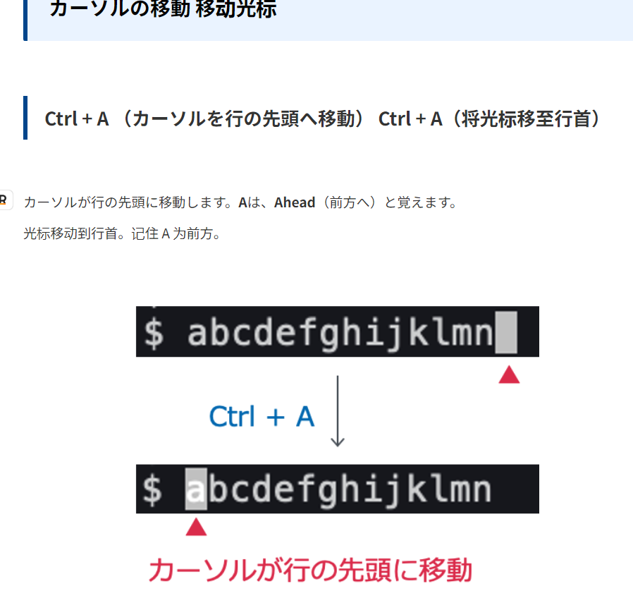
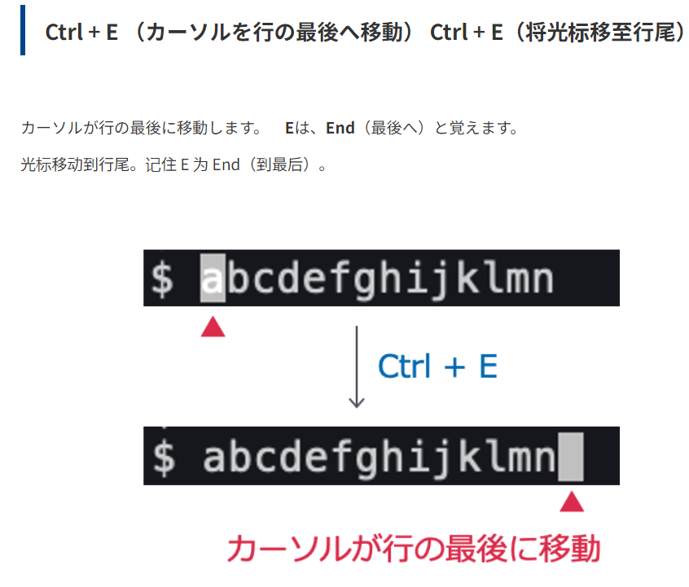

# 如何在xubuntu中打中文

=====================
以下是一种常用的方法，使用 `ibus`和 `ibus-pinyin`来实现中文输入：

1. **安装输入法框架和中文输入法引擎**：

   ```bash
   sudo apt-get update
   sudo apt-get install ibus ibus-pinyin
   ```
2. **重启ibus**：

   ```bash
   ibus-daemon -drx
   ```
3. **设置输入法**：
   打开系统的 `Settings` -> `Language Support`，在 `Keyboard input method system`选择 `IBus`。
4. 打开 `IBus Preferences`（你可以在开始菜单找到或者直接在终端中输入 `ibus-setup`来打开）。在 `Input Method`选项卡中，点击 `Add`，在弹出的窗口中选择 `Chinese` -> `Pinyin`，然后点击 `Add`按钮。
5. 完成设置后，你可以使用默认的 `Super`键（通常是键盘上的Windows键）+ `Space`组合键在不同的输入法之间切换。
6. **设置中文输入法的快捷键**：
   打开 `IBus Preferences`，在 `General`选项卡中，点击 `Next input method`，然后按下你想要设置的快捷键，比如 `Ctrl` + `Space`，然后点击 `OK`按钮。


# カーソルの移動




